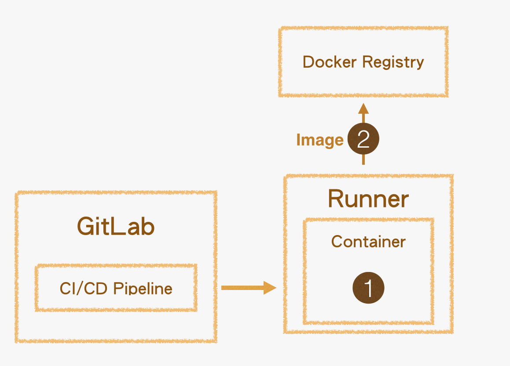

# gitlab-ci 配置说明

参考资料

- [gitlab-ci.yml 说明](https://docs.gitlab.com/ee/ci/yaml/gitlab_ci_yaml.html)
- [gitlab-ci.yml 关键字功能详细介绍](https://docs.gitlab.com/ee/ci/yaml/)



## pipeline 核心概念

### job 任务

### stage 阶段

```yaml
stages:
  - build
  - test

build-code-job:
  stage: build
  script:
    - echo "Check the ruby version, then build some Ruby project files:"
    - ruby -v
    - rake

test-code-job1:
  stage: test
  script:
    - echo "If the files are built successfully, test some files with one command:"
    - rake test1

test-code-job2:
  stage: test
  script:
    - echo "If the files are built successfully, test other files with a different command:"
    - rake test2

```

> 任务(job)可以挂载到对应的(stage), stage 执行顺序在 stages 段指定， 同一 stage 下的任务可能会并行执行

## 需要注意的几个小tip

### 默认值

```text

如果gitlab-ci.yml里没有定义 stages，则会使用默认的几个 stage
If stages is not defined in the .gitlab-ci.yml file, the default pipeline stages are:

.pre
build
test
deploy
.post
```

```text
如果job没有手动绑定到任何 stage， 则默认会绑定到 test stage
If stage is not defined, the job uses the test stage by default.
```

### job 定义注意事项
`tags` 使用 tags 来选择执行该 job 的runner  
注册 job runner 时会指定 job runner 的 tag, tag全部匹配才可以在此 runner 上运行


### 在不同的job之间共享文件

- [构建产物 artifacts](https://docs.gitlab.com/ee/ci/yaml/#artifacts)  
Use artifacts to specify a list of files and directories that are attached to the job when it succeeds, fails, or
always.

- [dependencies](https://docs.gitlab.com/ee/ci/yaml/#dependencies)  
Use the dependencies keyword to define a list of jobs to fetch artifacts from. You can also set a job to download no
artifacts at all.  
使用 `dependencies` 关键字来定义需要依赖的任务，会将依赖的构建产物下载下来  
If you do not use dependencies, all artifacts from previous stages are passed to each job.  
如果没有使用 `dependencies` 关键字， 之前所有阶段的构建产物都会被忽略


