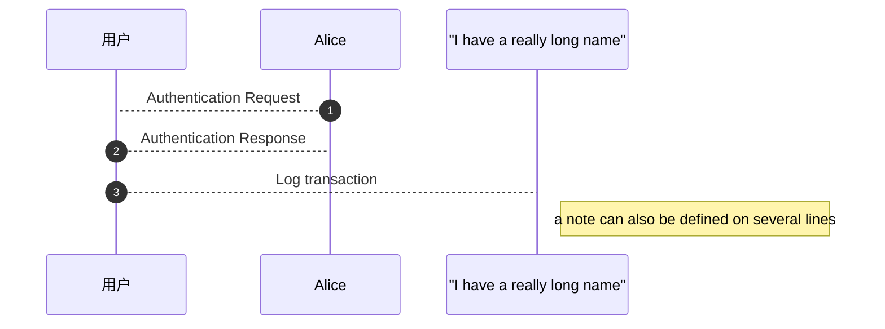
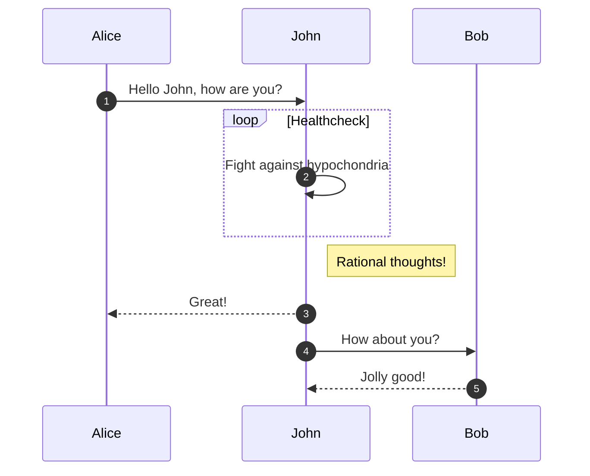
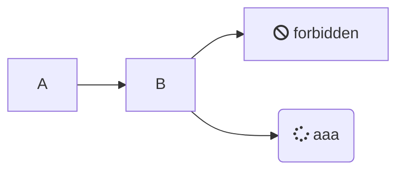
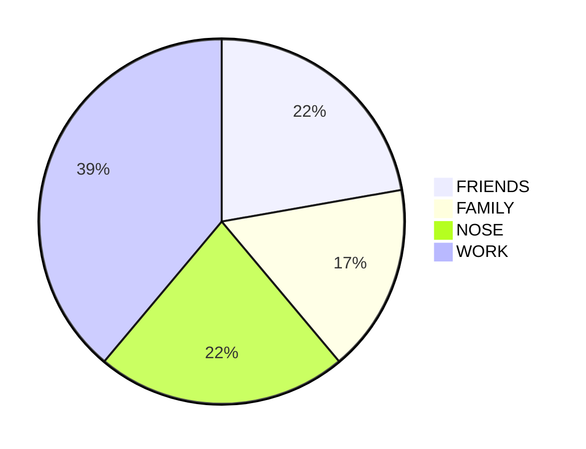
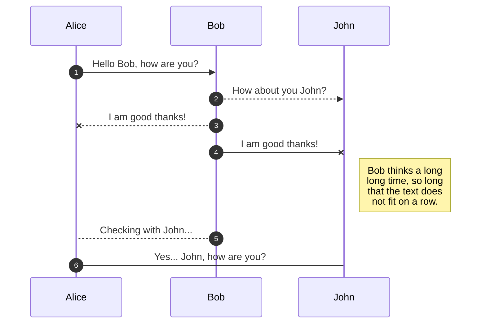
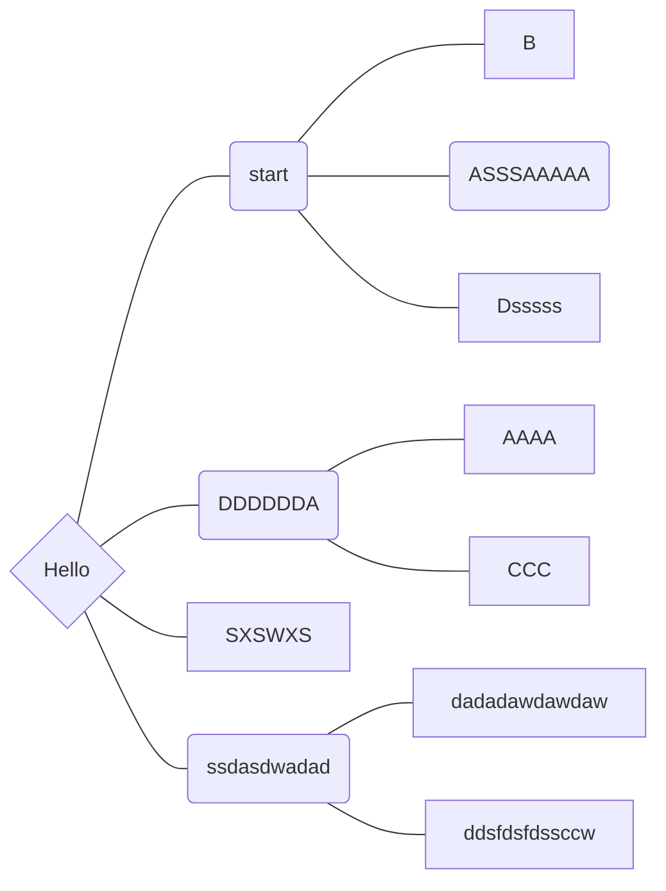
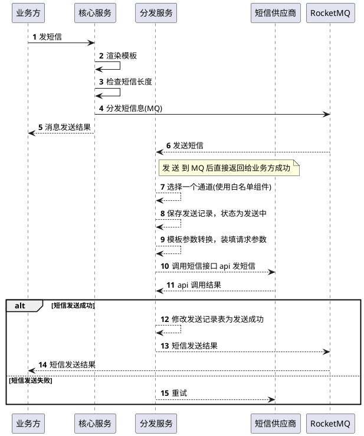

# Mermaid

```mermaid
sequenceDiagram
autonumber
participant user as 用户
%% The only difference between actor
%% and participant is the drawing
participant Alice
participant  L as "I have a really long name"
%% You can also declare
Alice --> user: Authentication Request
user --> Alice: Authentication Response
user --> L : Log transaction
Note right of L : a note can also be defined on several lines


```

---

```mermaid
sequenceDiagram
autonumber
Alice->>John: Hello John, how are you?
loop Healthcheck
	John->>John: Fight against hypochondria
end
Note right of John: Rational thoughts!
John-->>Alice: Great!
John->>Bob: How about you?
Bob-->>John: Jolly good!
```

---

```mermaid
     graph LR
      A --> B
      B-->C[fa:fa-ban forbidden]
      B-->D(fa:fa-spinner aaa);
```

---

```mermaid
pie 
         "FRIENDS" : 4
         "FAMILY" : 3
         "NOSE" : 4
         "WORK" : 7
```

---

```mermaid
sequenceDiagram
  autonumber
    Alice ->> Bob: Hello Bob, how are you?
    Bob-->>John: How about you John?
    Bob--x Alice: I am good thanks!
    Bob-x John: I am good thanks!
    Note right of John: Bob thinks a long<br/>long time, so long<br/>that the text does<br/>not fit on a row.

    Bob-->Alice: Checking with John...
    Alice->John: Yes... John, how are you?
```

```mermaid

graph LR
D{Hello}
  A(start)
  D---A
    C(ASSSAAAAA)
    A --- B
    A --- C
    A --- Dsssss
  E(DDDDDDA)
  D --- E
    E --- AAAA
    E --- CCC
   
  D --- SXSWXS
  F(ssdasdwadad)
  D --- F
    F --- dadadawdawdaw
    F --- ddsfdsfdssccw
```

```plantuml
@startuml
autonumber
participant  业务方 as biz

participant 核心服务 as core

participant  分发服务 as disp
participant  短信供应商 as cloud
participant  RocketMQ as mq

biz -> core: 发短信
core -> core: 渲染模板
core -> core: 检查短信长度
core -> mq: 分发短信息(MQ)
core --> biz: 消息发送结果

mq --> disp: 发送短信
note right of disp : 发 送 到 MQ 后直接返回给业务方成功
disp--> disp: 选择一个通道(使用白名单组件)
disp --> disp: 保存发送记录，状态为发送中
disp --> disp: 模板参数转换，装填请求参数
disp --> cloud: 调用短信接口 api 发短信
cloud --> disp: api 调用结果
alt  短信发送成功
disp --> disp: 修改发送记录表为发送成功
disp --> mq: 短信发送结果
mq --> biz: 短信发送结果
else 短信发送失败

disp --> cloud : 重试
end
@enduml
```
