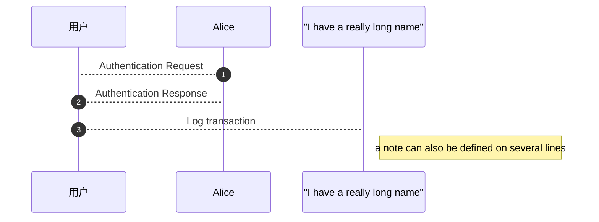
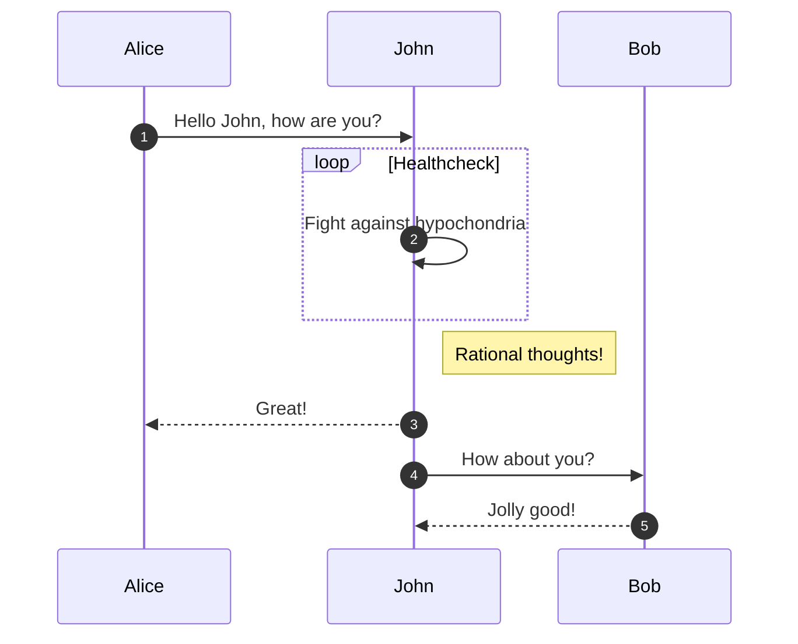
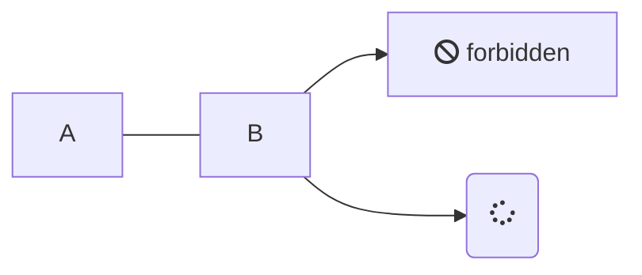
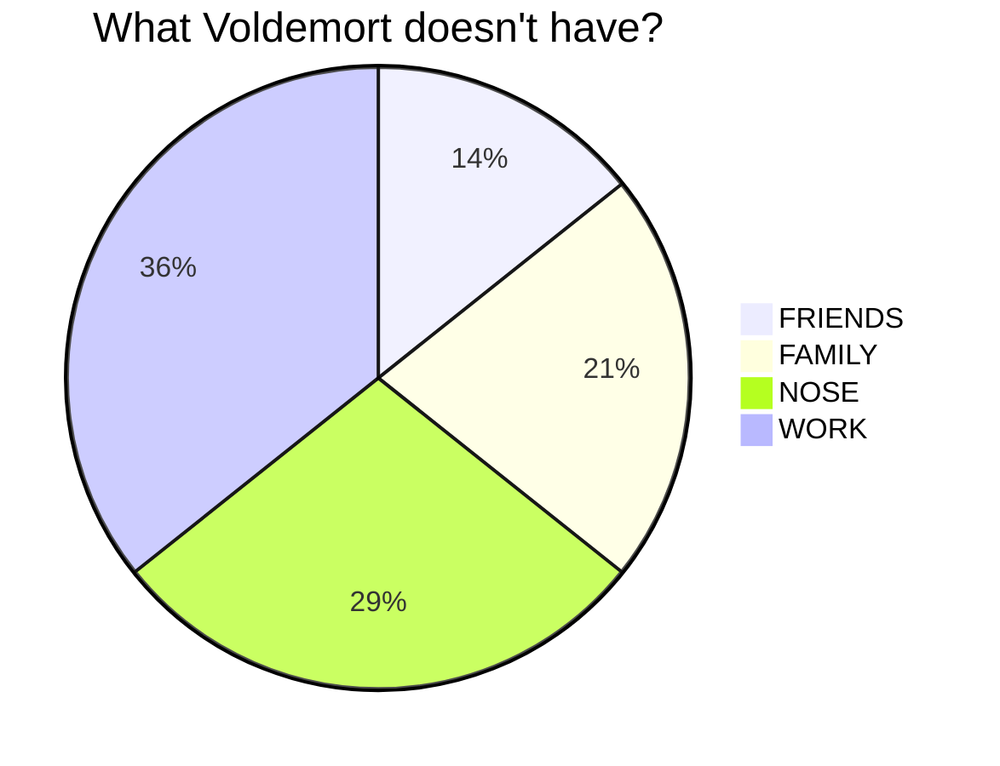
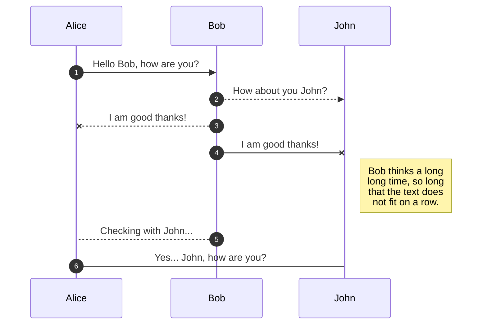

# Mermaid

```mermaid
sequenceDiagram
autonumber
participant user as 用户
%% The only difference between actor
%% and participant is the drawing
participant Alice
participant  L as "I have a really long name"
%% You can also declare
Alice --> user: Authentication Request
user --> Alice: Authentication Response
user --> L : Log transaction
Note right of L : a note can also be defined on several lines


```

---

```mermaid
sequenceDiagram
    autonumber
    Alice->>John: Hello John, how are you?
    loop Healthcheck
        John->>John: Fight against hypochondria
    end
    Note right of John: Rational thoughts!
    John-->>Alice: Great!
    John->>Bob: How about you?
    Bob-->>John: Jolly good!
```

---

```mermaid
     graph LR
      A --- B
      B-->C[fa:fa-ban forbidden]
      B-->D(fa:fa-spinner);
```

---

```mermaid
pie title What Voldemort doesn't have?
         "FRIENDS" : 2
         "FAMILY" : 3
         "NOSE" : 4
         "WORK" : 5
```

---

```mermaid
sequenceDiagram
  autonumber
    Alice ->> Bob: Hello Bob, how are you?
    Bob-->>John: How about you John?
    Bob--x Alice: I am good thanks!
    Bob-x John: I am good thanks!
    Note right of John: Bob thinks a long<br/>long time, so long<br/>that the text does<br/>not fit on a row.

    Bob-->Alice: Checking with John...
    Alice->John: Yes... John, how are you?
```
