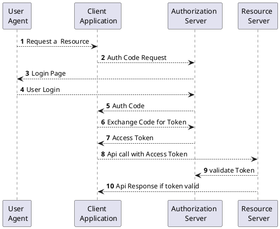
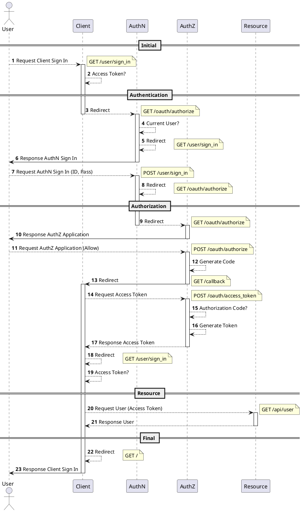

```plantuml
@startuml
autonumber
participant  "User \n Agent" as ua
' The only difference between actor
' and participant is the drawing
participant  "Client \n Application" as ca
participant   "Authorization \n Server" as as
participant   "Resource \n Server" as rs
' You can also declare
ua --> ca: Request a  Resource 
ca --> as: Auth Code Request
as --> ua : Login Page
ua --> as : User Login
as --> ca : Auth Code
ca --> as : Exchange Code for Token
as --> ca : Access Token
ca --> rs : Api call with Access Token
rs --> as : validate Token
rs --> ca : Api Response if token valid
@enduml
```
---

```plantuml
@startuml
autonumber

actor User

== Initial ==

User --> Client : Request Client Sign In
note right : GET /user/sign_in

activate Client
Client --> Client : Access Token?

== Authentication ==

Client --> AuthN : Redirect
note right : GET /oauth/authorize
deactivate Client

activate AuthN
AuthN --> AuthN : Current User?
AuthN --> AuthN : Redirect
note right : GET /user/sign_in
User <- AuthN : Response AuthN Sign In
deactivate AuthN

User --> AuthN : Request AuthN Sign In (ID, Pass)

activate AuthN
note right : POST /user/sign_in
AuthN --> AuthN : Redirect
note right : GET /oauth/authorize

== Authorization ==

AuthN --> AuthZ : Redirect
note right : GET /oauth/authorize
deactivate AuthN

activate AuthZ
User <- AuthZ : Response AuthZ Application
deactivate AuthZ

User --> AuthZ : Request AuthZ Application (Allow)
note right : POST /oauth/authorize

activate AuthZ
AuthZ --> AuthZ : Generate Code

Client <- AuthZ : Redirect
note right : GET /callback
deactivate AuthZ

activate Client
Client --> AuthZ : Request Access Token
note right : POST /oauth/access_token

activate AuthZ
AuthZ --> AuthZ : Authorization Code?
AuthZ --> AuthZ : Generate Token

Client <-- AuthZ : Response Access Token
deactivate AuthZ

Client --> Client : Redirect
note right : GET /user/sign_in

Client --> Client : Access Token?

== Resource ==

Client --> Resource : Request User (Access Token)
note right : GET /api/user

activate Resource
Client <-- Resource : Response User
deactivate Resource

== Final ==

Client --> Client : Redirect
note right : GET /

User <- Client : Response Client Sign In
deactivate Client
@enduml
```
