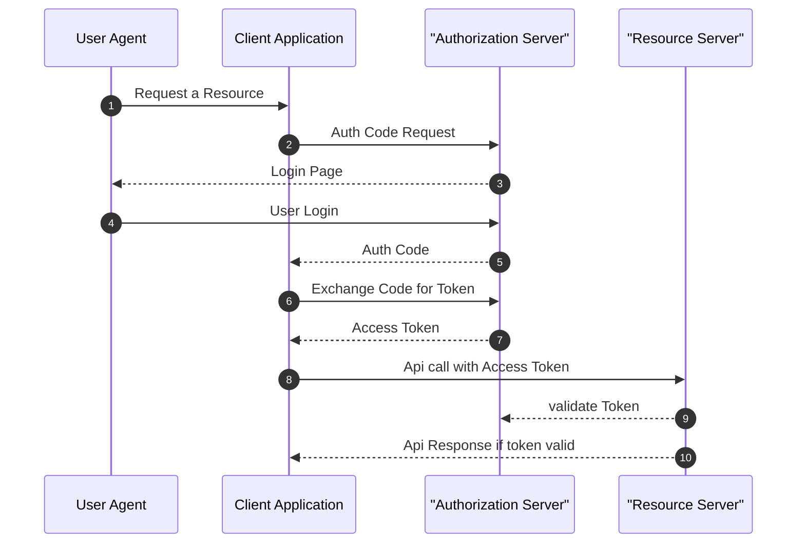

```mermaid
sequenceDiagram
autonumber
participant ua as User Agent
%% The only difference between actor
%% and participant is the drawing
participant ca as Client Application
participant  as as "Authorization Server"
participant  rs as "Resource Server"
%% You can also declare
ua ->> ca: Request a  Resource 
ca ->> as: Auth Code Request
as -->> ua : Login Page
ua ->> as : User Login
as -->> ca : Auth Code
ca ->> as : Exchange Code for Token
as -->> ca : Access Token
ca ->> rs : Api call with Access Token
rs -->> as : validate Token
rs -->> ca : Api Response if token valid
```

