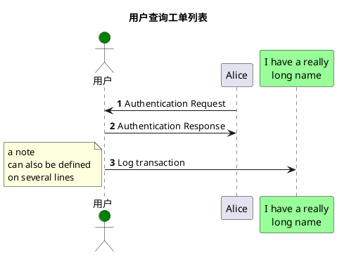

# plantuml

### 用户查询工单列表

```plantuml


@startuml
autonumber
title 用户查询工单列表
actor 用户 as user #green
' The only difference between actor
'and participant is the drawing
participant Alice
participant "I have a really\nlong name" as L #99FF99
/' You can also declare:
participant L as "I have a really\nlong name" #99FF99
'/
Alice ->user: Authentication Request
user ->Alice: Authentication Response
user ->L: Log transaction
note left
a note
can also be defined
on several lines
end note
@enduml

```